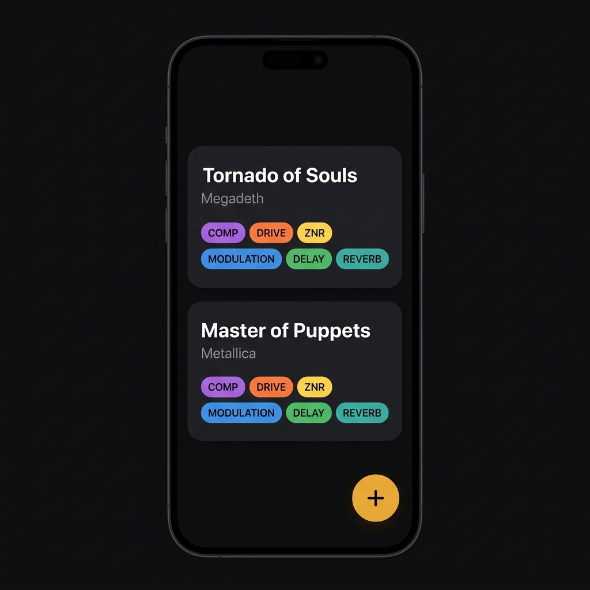

# 🎸 Zoom G1 Patches Manager

O **Zoom G1 Patches Manager** é um aplicativo mobile moderno desenvolvido com **React Native** e **Expo**, projetado especificamente para guitarristas que utilizam os pedais multiefeitos da linha **Zoom G1** (como o Zoom G1 Four e G1X Four).

Ele funciona como um diário e organizador digital de "patches" (configurações de efeitos), permitindo criar, listar, detalhar, editar e excluir as cadeias de pedais necessárias para reproduzir os timbres mais marcantes de grandes artistas e canções clássicas da história da música.

<div align="center">
  
</div>

---

## ✨ Principais Funcionalidades

- **Cadeia de Efeitos Completa (Simulação de Hardware)**: Configure detalhadamente cada slot de efeito do pedal físico diretamente na tela do app:
  - **Volume Geral (Patch Level)**: Controle do nível de volume de cada preset.
  - **Compressor/Booster (Comp/EFX)**: Escolha de compressores e boosters clássicos com seus respectivos parâmetros.
  - **Distorção/Drive (Drive)**: Simuladores de pedais clássicos de Overdrive, Fuzz e amplificadores famosos com ajuste fino de ganho.
  - **Equalizador (EQ)**: Equalizador ativo de 3 bandas (Graves, Médios e Agudos) para esculpir o som.
  - **Redutor de Ruído (ZNR)**: Ajuste do *Zoom Noise Reduction* e simuladores de caixas acústicas.
  - **Modulação (Modulation)**: Chorus, Flanger, Ensemble, Vibrato, Phaser e outros moduladores com rate e profundidade ajustáveis.
  - **Delay (Delay)**: Tipos de Delay (Analógico, Ping Pong, Tape Echo) com controle de tempo e volume de repetição.
  - **Reverb (Reverb)**: Simuladores de ambiente (Hall, Room, Spring, Arena) com tempo de decaimento (*decay*).

- **Persistência de Dados Local (SQLite)**: Banco de dados local offline rápido e robusto utilizando o `expo-sqlite`, garantindo que os patches carreguem instantaneamente e continuem salvos sem a necessidade de conexão com a internet.

- **Banco de Dados Pré-semeado (Pre-seeded Patches)**: Ao iniciar pela primeira vez, o aplicativo já vem carregado com dezenas de timbres icônicos de clássicos da guitarra, como:
  - **Megadeth** (*Tornado of Souls*)
  - **Metallica** (*Master of Puppets*, *Enter Sandman*, *Blackened*, *One*)
  - **Alice in Chains** (*Rooster*)
  - **Red Hot Chili Peppers** (*Minor Thing*)
  - **AC/DC** (*Angus Young Sound*)
  - **Pantera** (*Cemetery Gates* - Clean, Distortion & Solo)
  - **Pearl Jam** (*Yellow Ledbetter*)
  - **Ozzy Osbourne** (*Crazy Train*)
  - **Black Sabbath** (*N.I.B.*)
  - **Jimi Hendrix** (*Octave Fuzz*)

- **Busca & Ordenação Dinâmica**: Localize timbres rapidamente digitando o nome da música ou do artista. A ordenação permite classificar os timbres alfabeticamente ou pelos adicionados recentemente.

- **Design Dark Mode Premium**: Interface escura e elegante pensada para uso confortável em palcos, estúdios ou locais de pouca luz. Utiliza tipografia moderna (`DM Sans` e `Space Mono`) com transições e animações suaves (`react-native-reanimated`).

- **Validação Robusta**: Formulários dinâmicos gerenciados com `react-hook-form` e validados via `zod` para prevenir a inserção de parâmetros inválidos ou dados inconsistentes.

---

## 🛠️ Stack Tecnológico

O projeto foi construído utilizando as melhores e mais recentes tecnologias do ecossistema mobile:

- **React Native** & **Expo (v56)**: Plataforma principal de desenvolvimento híbrido.
- **TypeScript**: Tipagem estática para máxima segurança, facilidade de refatoração e redução de bugs.
- **SQLite** (`expo-sqlite`): Banco de dados embarcado relacional de alto desempenho para armazenamento local de dados.
- **React Navigation (v7)**: Navegação nativa fluida em pilha (Native Stack Navigation).
- **React Hook Form** + **Zod**: Gerenciamento de formulários otimizado e validações em tempo de execução baseadas em esquemas tipados.
- **React Native Reanimated**: Micro-interações e transições de tela altamente otimizadas na thread nativa de UI.

---

## 📂 Estrutura de Diretórios

A estrutura do projeto é limpa, modular e organizada seguindo as melhores práticas de arquitetura para React Native:

```
├── App.tsx                    # Componente raiz do aplicativo (carrega fontes e inicia BD)
├── app.json                   # Configurações do Expo Application
├── index.ts                   # Ponto de entrada da aplicação
├── src
│   ├── components             # Componentes de UI reutilizáveis (cards, loaders, filtros, modais)
│   ├── constants              # Constantes de design (cores, fontes do sistema, dimensões)
│   ├── context                # Contextos globais da aplicação (ex: ToastContext de alertas)
│   ├── database               # Lógica de banco de dados (inicialização, seeding de patches e queries SQL)
│   │   ├── db-init.ts         # Script DDL de criação e seeding inicial com dezenas de patches
│   │   └── patches-service.ts # Serviços CRUD de banco de dados
│   ├── hooks                  # Hooks personalizados de gerenciamento de estado ou lógica encapsulada
│   ├── navigation             # Configuração e tipagem da navegação do aplicativo
│   ├── screens                # Telas completas da aplicação
│   │   ├── patch-list-screen.tsx   # Painel principal com busca, ordenação e listagem
│   │   ├── patch-detail-screen.tsx # Visualização completa da cadeia de pedais configurada
│   │   └── patch-form-screen.tsx   # Formulário para criar ou editar patches com validação Zod
│   └── types                  # Definições de tipos TypeScript globais (ex: entidade Patch)
```

---

## 🚀 Como Executar o Projeto Localmente

Siga o passo a passo abaixo para rodar o aplicativo em sua máquina de desenvolvimento:

### Pré-requisitos
Antes de começar, certifique-se de ter instalado em sua máquina:
- [Node.js](https://nodejs.org/) (Versão LTS recomendada)
- Gerenciador de pacotes **npm** (já incluso com o Node) ou **Yarn**
- O aplicativo **Expo Go** instalado no seu dispositivo móvel (iOS ou Android) para testar no aparelho físico, ou emuladores configurados ([Android Studio](https://developer.android.com/studio) / [Xcode](https://developer.apple.com/xcode/)).

### Passo 1: Clonar o Repositório
```bash
git clone https://github.com/seu-usuario/zoom-g1-patches.git
cd zoom-g1-patches
```

### Passo 2: Instalar as Dependências
Instale todos os pacotes necessários do projeto executando:
```bash
npm install
```

### Passo 3: Iniciar o Servidor do Expo
Inicie o servidor de desenvolvimento do Expo:
```bash
npm run start
```

### Passo 4: Executar no Dispositivo
- **No celular físico**: Abra o aplicativo **Expo Go** em seu celular e escaneie o código QR exibido no terminal (Android) ou use a câmera para abrir o link (iOS).
- **No Emulador Android**: Com o emulador já aberto, pressione a tecla `a` no terminal onde o Expo está rodando.
- **No Simulador iOS**: Com o simulador aberto, pressione a tecla `i` no terminal onde o Expo está rodando.

---

### Autor
| Matheus Bibiano                                       |
|-------------------------------------------------------|
| |
| [](https://www.linkedin.com/in/matheus-bibiano-alves)|
<br/>

---

## 📜 Licença

Este projeto está licenciado sob a licença MIT - consulte o arquivo [LICENSE](LICENSE) para obter mais detalhes.
